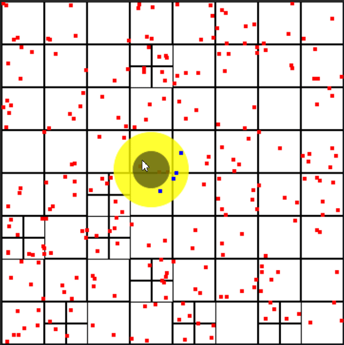
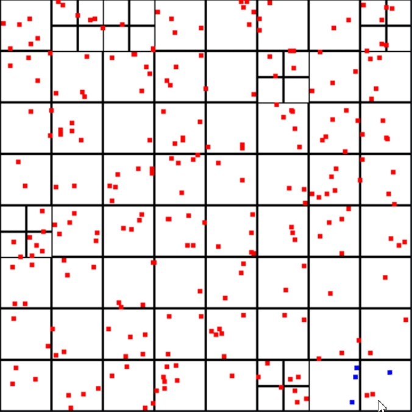
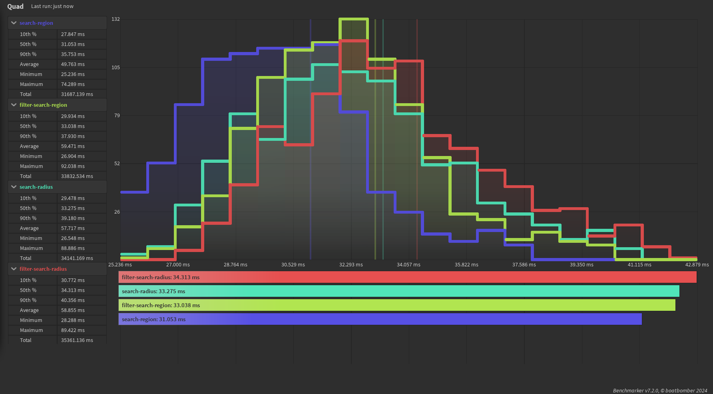
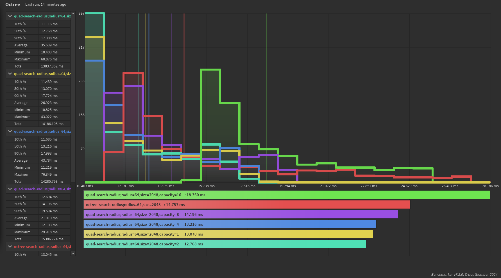

A binary tree optimized for 2D querying

# Search Radius
Allows for searching for items within a set distance from a point, a second method is also available for filtered queries where it skips areas within an inner radius.

# Search Region
Allows for searching for items within a set bounds, a second method is also available for filtered queries where it skips areas within an inner bounds.

# Benchmark
I ran a benchmark with this configuration:
- 1,024 queries per test, across 10,000 tests
- query diameter of 1024 (used as box width and height for region searches)
- points distributed along a range of 32,768 across the x and y axes
- 20,000 points

The fastest was :SearchRegion(), with around 30.3 microseconds per query - allowing for around 32,000 queries a second. The other methods aren't much slower, however filters are slightly slower in general, and region querying is a bit faster than radius querying.

# Octree Comparisons
Historically I've used Sleitnick's [octo-tree implementation](https://github.com/Sleitnick/rbxts-octo-tree), which I heavily recommend for 3D querying. However, many of my queries are actually 2D so I theorized I could get performance benefits by writing a solution from scratch for just 2 dimensions + allows me the opportunity to add in some desired filter methods.

I ran a benchmark with this configuration:
- 2,048 queries per test, across 10,000 tests
- query diameter of 1024 (used as box width and height for region searches)
- points distributed along a range of 32,768 across the x and y axes
- 512 points

For now though, my implementation is unoptimized - if you have fewer than around ~2500 items my quad-tree is faster, otherwise theirs is faster.

# Further Development
It's deeply annoying that the octree is faster than this quad-tree one in 2D operations. I'm publishing this now because it has handy APIs and it is technically faster below a certain limit, however expect further development to be in the area of optimization.
